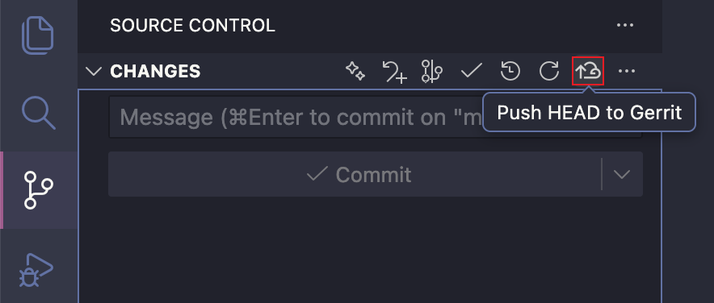

# Gerrit Push Button

Adds a button in VS Code Source Control to push `HEAD` to `refs/for/<branch>` on your Gerrit remote for review.

## Features
- Source Control title bar button and Command Palette command: **Gerrit: Push HEAD to Gerrit**
- Runs `git push <remote> HEAD:refs/for/<branch>` with a branch picker
- Defaults to the current branch; override with `gerritPush.defaultBranch`
- Remote defaults to `origin`; override with `gerritPush.remote`



## Setup & Debug
1) Install dependencies:
```bash
npm install
```
2) Open the `vscode-gerrit-push` folder in VS Code.
3) Open the “Run and Debug” panel, choose `Run Extension`, and hit “Run” (or press F5). This launches an Extension Development Host that builds and loads the extension.

## Usage
1) Open a Git workspace.
2) In the Source Control view title bar, click the icon button **Push HEAD to Gerrit**, or run the command with the same name from the Command Palette.
3) Pick the target branch (current branch, configured default branch, or a custom value).
4) Confirm the prompt `git push <remote> HEAD:refs/for/<branch>`.
5) The extension resolves the Git root via VS Code’s Git SCM (falls back to `git rev-parse`), so multi-repo workspaces push from the right repo.

## Settings
- `gerritPush.defaultBranch`: default branch for `refs/for/<branch>` (empty = current branch).
- `gerritPush.remote`: Git remote name to push to (default `origin`).

## Package for distribution
1) Install dependencies (first time or after updates):
```bash
npm install
```
2) Build a VSIX:
```bash
npm run package
```
The generated `.vsix` can be shared and installed via VS Code’s Extensions panel “Install from VSIX...”.

## Metadata
- Icons: generated with Nano Banana Pro (`images/icon.png`, `images/command-icon.png`)
- Repository: https://github.com/liaojianjin/vscode-gerrit-push
- License: MIT (see `LICENSE`)
